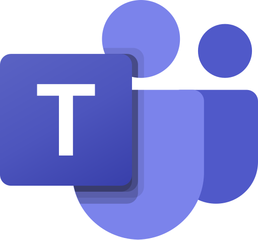

# Aster - Microsoft Teams Bot setup

<div align="center">
    
</div>

## Overview

In this tutorial, you'll learn how to setup your Aster Teams App and Bot.

At the end, you should have a new Teams app available in your organization and the necessary environment variables to configure Aster.

## Prerequisites

- Clone the Aster repository
- An Azure account with permissions to create resources (or access to an admin who can)
- Access to the [Microsoft Teams Developer Portal](https://dev.teams.cloud.microsoft/apps)
- A Microsoft 365 organization where you can upload/publish custom apps

## Setup

### 1. Create an Azure Bot

1. Sign in to the [Azure Portal](https://portal.azure.com/) and click **Create a resource**.
2. Search for **Azure Bot**, then click **Create**.
3. In the **Basics** tab:
   - **Bot handle**: Enter a unique name (e.g., `Aster-YourOrg`).
   - **Subscription**: Select your subscription.
   - **Resource group**: Select existing or create new.
   - **Data residency**: Select **Global**.
   - **Pricing tier**: Select **Free (F0)**.
   - **Type of App**: Select **Single Tenant**.
   - **Creation type**: Select **Create new Microsoft App ID**.
   - Click **Next**.
4. (Optional) Add tags in the **Tags** tab.
5. In the **Review + create** tab, click **Create**.

### 2. Configure Messaging Endpoint and Credentials

Once the Azure Bot resource is created, you need to configure the endpoint and gather credentials for your `.env` file.

1. **Add Microsoft Teams channel**

   - Go to the resource details page and select **Channels** in the left navigation menu.
   - Find **Microsoft Teams** channel under the **Available Channels** section and click on it.
   - Agree the Terms of Service modal if prompted.
   - There will be three tabs **Messaging**, **Calling**, and **Publish**. No need to change any tabs just click **Apply**.
   - Once apply is completed click close.
   - The **Microsoft Teams** should be added.

2. **Configure Endpoint**:

   - Select **Configuration** in the left navigation menu.
   - In **Messaging endpoint**, enter your Aster instance URL:
     `https://<your-aster-domain or ngrok url for local dev>/api/messages`
     (e.g., `https://aster-runner-running.ngrok-free.app/api/messages`)
   - Click **Apply**.

3. **Get Microsoft App ID**:

   - Still on the **Configuration** page, copy the **Microsoft App ID**. This is your `MICROSOFT_APP_ID`.

4. **Get Client Secret**:

   - Click the **Manage Password** link next to the Microsoft App ID (or go to **Certificates & secrets** in the associated App Registration).
   - Click **+ New client secret**.
   - Add a description (e.g., `aster-self-hosted`), set the expiration (recommended: **730 days**), and click **Add**.
   - **Immediately copy the Value**. This is your `MICROSOFT_APP_PASSWORD`.

5. **Get Tenant ID**:
   - In the same menu, click **Overview** on the left.
   - Copy the **Directory (tenant) ID**. This is your `MICROSOFT_APP_TENANT_ID`.

6. **Add redirect uri**
   - In the same menu, expand **Manage** and click **Authentication** to add a redirect uri.
   - Click **Add Redirect URI** it will open a drawer from the right.
   - Select **Web**
   - In the next step type `https://<domain-where-frontend-is-hosted>/redirect/teams` (e.g., `https://app.aster.so/callback/teams`). This is your `MICROSOFT_APP_REDIRECT_URI`.
   - Check **Access tokens** and **ID tokens** checkboxes.
   - Click **Configure**, it will add the URI.

### 3. Update Environment Variables

Add the following variables to your Aster `.env` file using the values you retrieved in the previous step.

```env
MICROSOFT_APP_TYPE=SingleTenant
MICROSOFT_APP_ID="<Your-Microsoft-App-ID>"
MICROSOFT_APP_PASSWORD="<Your-Microsoft-App-Password>"
MICROSOFT_APP_TENANT_ID="<Your-Tenant-ID>"
MICROSOFT_TEAMSBOT_URL="https://<your-aster-domain or ngrok url for local dev>"
MICROSOFT_APP_REDIRECT_URI="https://<your-aster-domain or ngrok url for local dev>/callback/teams"
MICROSOFT_APP_SCOPE="User.Read.All Directory.ReadWrite.All offline_access TeamsAppInstallation.ReadWriteForUser Team.ReadBasic.All Channel.ReadBasic.All ChannelMessage.Read.All"
```

### 4. Create and Publish the Teams App

1. Generate an UUID v4 and use it as `id`.
2. Update `botId` and `webApplicationInfo.id` in the `config/teams/manifest.json` file with the with the Microsoft App ID you retrieved in the previous step.
3. Create a zip file using the `manifest.json`, `outline.png` and `color.png` files.
4. Sign in to the [Microsoft Teams Developer Portal](https://dev.teams.cloud.microsoft/apps) and go to the **Apps** page.
5. Click **Import app** in the top navigation bar.
6. Upload the zip file you created in step 2.
7. Once imported verify the details.
8. Click **Publish**.
9. Select **Publish to org**.
10. Click **Publish**.

### 5. Approve App and Get Teams App ID

An admin needs to approve the app for the organization and retrieve the final ID:

1. Go to the [Microsoft Teams admin center](https://admin.teams.microsoft.com/policies/manage-apps).
2. Navigate to **Teams apps** > **Manage apps**.
3. Search for **Aster** (or the name you gave it) and click on its name.
4. **Approve the app**: If it's pending approval, publish/approve it.
5. **Get Teams App ID**: On the details page, copy the value under **External App ID**. This is your `MICROSOFT_TEAMS_APP_ID`.
6. Add this value to your `.env` file.

## Test the Teams App

To test the app, ensure your Aster services are running and accessible via the domain you configured.

1. Go to Microsoft Teams and install the Aster app to a Team.
2. You should see a generic welcome message from the bot upon installation.
3. To chat with the bot, go to a channel in that Team and mention it: `@Aster hello` (replace "Aster" with your bot's name if different).

If you see a response from the bot, the setup is successful! 🥳

## Next Steps

If you were redirected to this guide from the main README.md, please continue setup [there](../../README.md).
